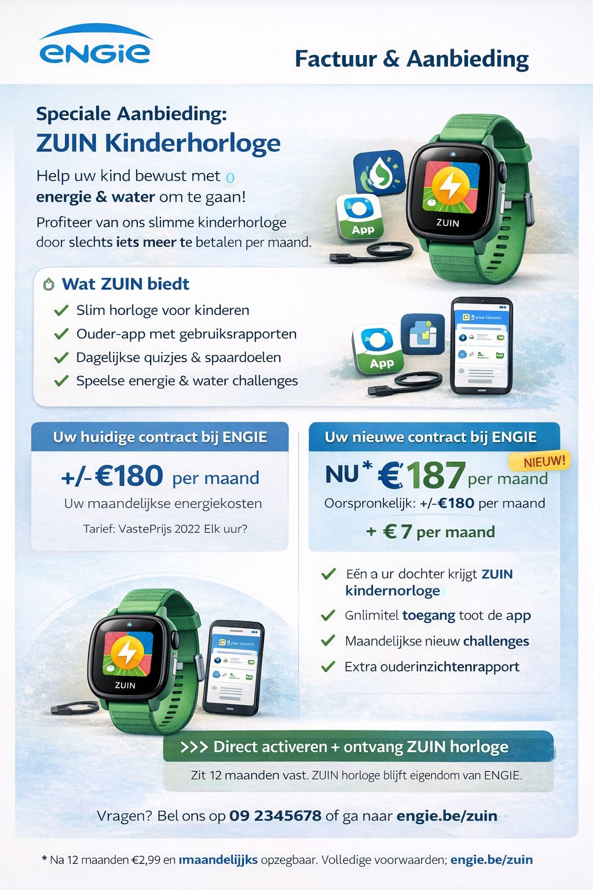
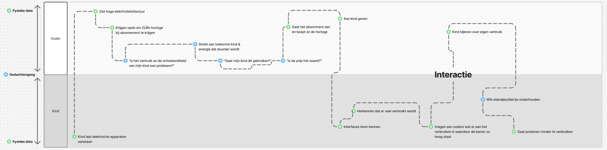
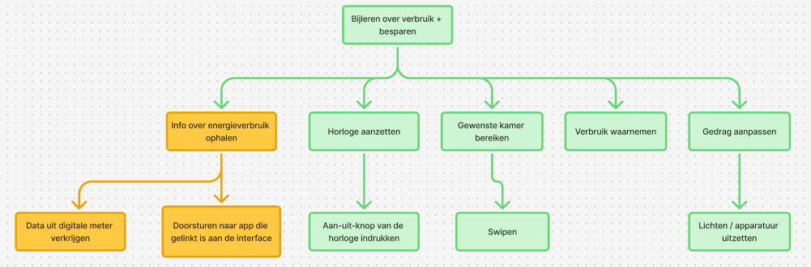
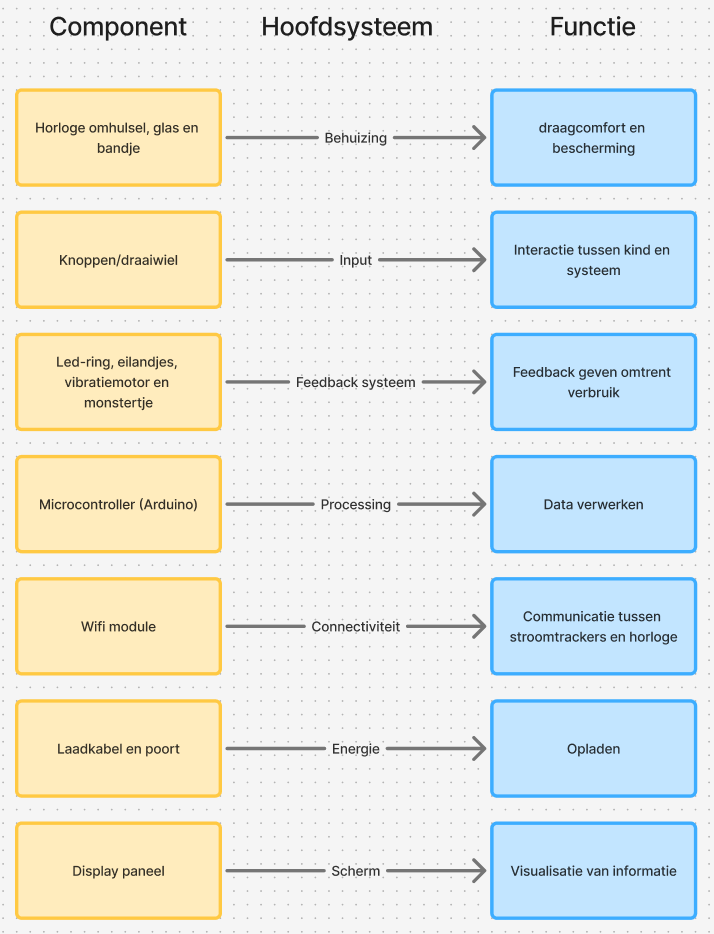
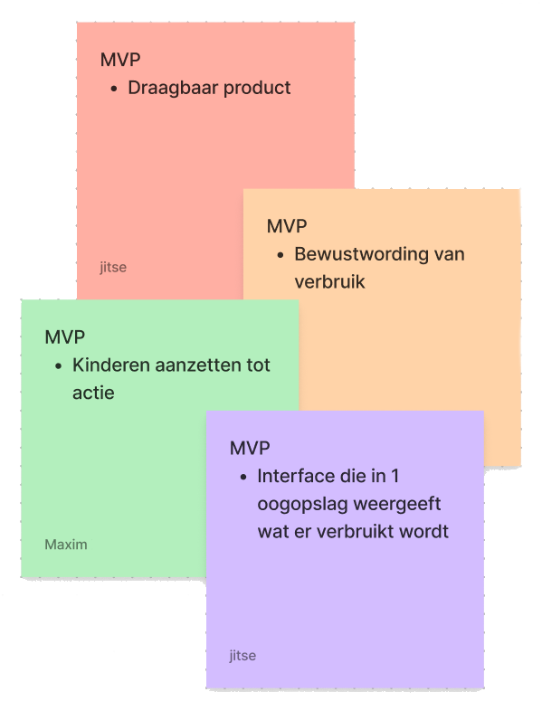
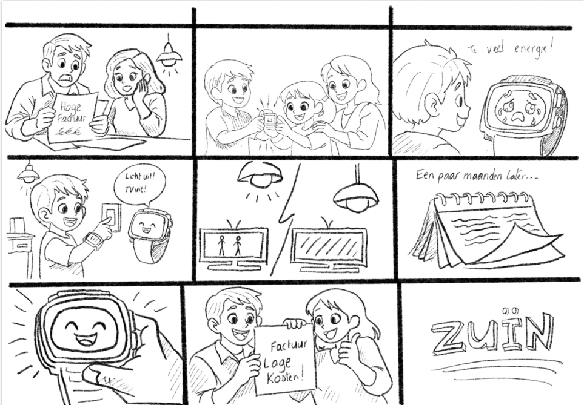
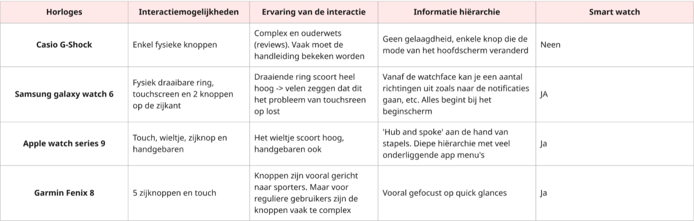
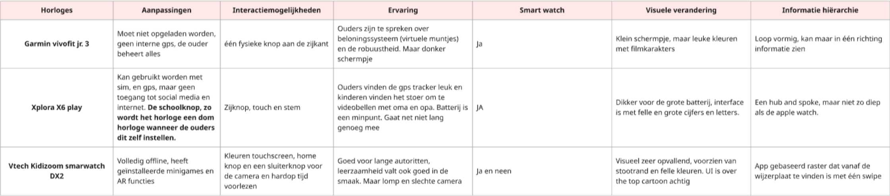
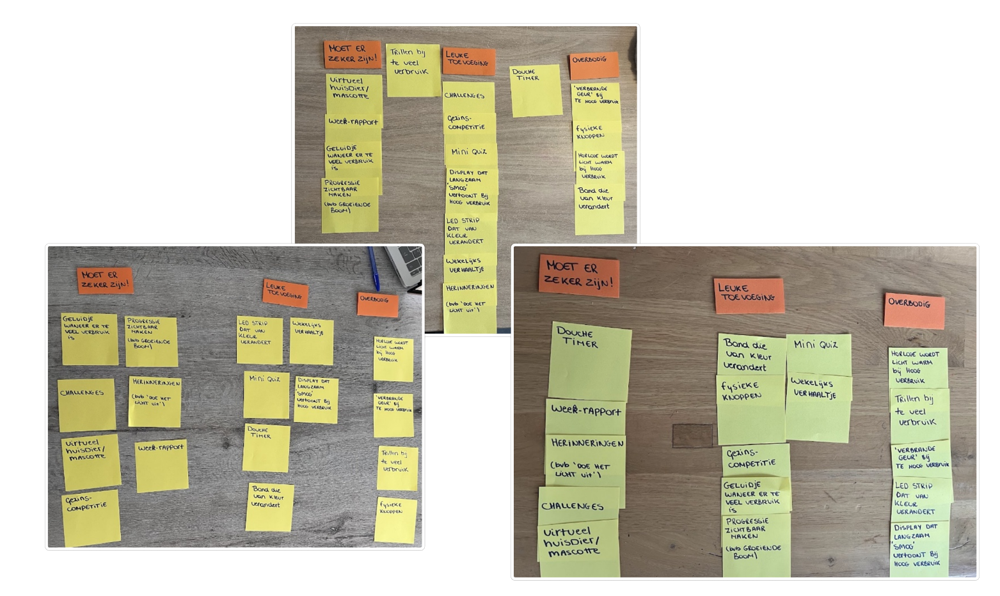
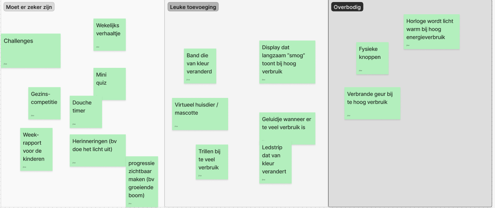

# Develop I

## Doelstellingen

Bij deze fase wordt de ontvangen tussentijdse feedback verwerkt en toegepast. Daarnaast wordt de kernfunctionaliteit en gebruikersinteracties aangescherpt. Hierdoor wordt er gehoopt de onderzoeksdoelstelling te verduidelijken, zodat er helderheid ontstaat omtrent wat er precies onderzocht moeten worden in verband met gedrags - of energiegerelateerde problemen.

## Materiaal & methoden

### Systeemanalyse

Om het project te verfijnen is er gestart met een functionele systeemanalyse. Hierbij wordt het product vanuit verschillende perspectieven bekeken. Hiervoor zijn 4 methodes toegepast. Deze methoden waren:

  * Customer journey: analyse van het volledig proces van de eerste confrontatie met het probleem tot    de interactie van het horloge met het kind.
  * HTA (Hierachial Task Analysis): het opsplitsen van het gebruik in taken en subtaken.
  * Productarchitectuur: Identificeren van verschillende componenten en datastromen en welke functie dit component heeft.
  * MVP (Minimum Viable Product): Bepaling van de minimale set functies die het toestel moet kunnen toepassen.
    
### Human-Product Interactions

De Human-Product Interactions werden gebruikt om inzichten te creëren omtrent de interacties tussen de gebruiker, het apparaat, het intern systeem van de horloge en de connectiviteit met uitwendige stroomtrackers. Hiervoor werd een funtioneel interactieschema opgesteld. Dit schema visualiseerd verschillende componenten, signalen en datastromen. De verschillende categorieën werden gegroepeerd:

  * Componenten
  * Feedback
  * User input
  * Data en verwerking

Deze interacties tonen de belangrijkste input-, verwerkings- en feedbackmechanismen. Wat later van belang is voor de productarchitectuur en interactielogica.

### Storyboard

Voor het visualiseren van een mogelijks gebruiksscenario is er een nieuwe storyboard gemaakt. Hierin worden de interacties tussen het product en de user gevisualiseerd. Dit is ondertussen al het tweede storyboard. Bij het eerste storyboard werd er nog in duister getast. Er was nog geen concreet concept of plan. In deze verdere fase is er al een concreet idee van het concept en dit is dan verwerkt in de storyboard.

### Deskresearch

Voor de ontwikkeling van het horloge werd een benchmarkanalyse uitgevoerd om de interacties zo gebruiksvriendelijk te maken. In een eerdere fase werd er ook een benchmarkanalyse uitgevoerd met als doel kennis te verwerven omtrent energiebesparende toestellen op de markt. In deze fase verschuift de focus naar slimme horloges, applicaties en digitale interfaces. Het doel is de meest intuïtieve en gebruiksvriendelijkeinteractie voor een slimme horloge voor kinderen te identificeren.

De analyse werd in 2 categoriên verdeeld:

 * Smartwatches voor volwassenen (N=4)
 * Smartwatches voor kinderen (N=3)
 * Habit apps (N=4)
   
Op basis van deze inzichten kan achteraf een kindvriendelijke horloge gemaakt worden.

### User testing

Om inzichten te krijgen omtrent koopbereidheid, gewenste functionaliteit en gebruikersverwachtingen werden interviews uitgevoerd met de ouders van kinderen in de lagere school (N=5). Aangezien ouders de uiteindelijke beslissing nemen om het product aan te schaffen, werd er gekozen om hen centraal te zetten in deze fase en hen te interviewen.

  

Thema's die aan bod kwamen waren:

 * Koopbereidheid
 * Functionaliteiten
 * Ervaringen met habit-changing producten

De interviews werden zowel online als fysiek uitgevoerd.

## Resultaten

### Systeemanalyse

#### Customer Journey

  
 
 * De analyse toont aan dat ouders de initiële trigger vormen. Dit is in de vorm van een hoge energiefactuur.
 * Na de trigger verschuift de interactie naar het kind. Het is aan hem/haar om bewuster te worden omtrent verbruik met behulp van het ZUIN horloge.
 * De feedback zorgt ervoor dat het kind verbruik leert te herkennen en zo zijn/haar gedrag aan te passen.
 * De eilandjes en het monstertje motiveren het kind om apparaten die niet in gebruik zijn uit te schakelen.

#### HTA

Bij de HTA is de hoofdtaak van het systeem: bijleren over energieverbruik om zo dan gedragsverandering te vertonen. Deze hoofdtaak wordt later opgesplitst in subtaken die dan wederom worden opgsplitst.

  

 * informatie over energieverbruik ophalen
   * Dat wordt verkregen via digitale stroommeters.
     * Deze data wordt doorgestuurd naar het horloge.
 * Horloge activeren
   * De gebruiker zet het horloge aan doormidden van een aan-uitknop
 * Gewenste kamer bereiken
   * Er kan tussen de eilandjes (kamers) genavigeerd worden doormiddel van swipen.
 * verbruik waarnemen
   * Het kind interpreteert de informatie die wordt weergegeven op het display.
 * gedrag aanpassen
   * Concrete actie wordt ondernomen.
     * Lichten of apparaten die niet in gebruik zijn worden uitgeschakeld.

#### Productarchitectuur

De productarchitectuur beschrijft welke functies bij welke componenten horen. Het toont ook hoe de energiegegevens uiteindelijk worden vertaald naar informatie voor de kinderen.

  
 
De volgende systemen worden geïdentificeerd:

 * Behuizing
 * Input
 * proccesing
 * feedbacksysteem
 * connectiviteit
 * energievoorziening
 * scherm

#### MVP

<table>
<tr>
<td width="60%">

De MVP-analyse identificeert de Minimum Viable product. Zo identificeert het de noodzakelijke functies voor het ZUIN project waar het zeker aan moet voldoen. Uit de analyse kwamen 4 MVP's naar boven:

- **Draagbaar product**  
  - Het systeem moet in de vorm van een horloge zodat kinderen het altijd bij zich hebben.

- **Bewustwording van verbruik**  
  - Het toestel moet informatie omtrent energieverbruik begrijpelijk maken voor kinderen.

- **Stimuleren tot actie**  
  - Het systeem moet kinderen aanzetten tot verandering in hun gedrag.

- **Interface met duidelijke interpretatie**  
  - Het moet zeer duidelijk in 1 oogopslag tonen wat er verbruikt wordt.

</td>

<td width="40%">

</td>
</tr>
</table>

 ### Human-Product Interactions
 
De HPI-analyse toont hoe de gebruikersinput, de gegevens en de feedback samenhangen en een geheel vormen. De interacties werden opgesplitst per systeemonderdeel.

  

 * Aan/Uit
   * Push input via knoppen
   * Presence sensor. De horloge krijgt de functie van het energie besparen enkel te huis. (constraints)
 * Metingen verbruik
   * Stroomtrackers bij elk apparaaat
   * Data wordt via connectiviteit met horloge verzonden
   * Gegevens worden verwerkt en opgeslagen in database
   * Arduino verwerkt data
   * Energieverbruik wordt weergegeven als eilandjes (metafoor voor verschillende kamers)
 * Scherm en interface
   * Touchscreen voor eenvoudig navigeren
   * Swipen om te navigeren tussen verschillende kamers
   * Display toont aan de hand van LED-ring of er veel of weinig verbruikt wordt
 * Feedback
   * Visuele feedback: display, LED-ring, monstertje
   * Speelse feedback: eilandjes, monstertje, verhaaltje
   * Haptische feedback: vibrerende motor
 * Antropometrie
   * Horlogeband
     * Moet rond de pols gedragen worden
       * Moet een kinderpols passen
   * Horloge-omhulsel
     * beschermen van elektronica
 
### Storyboard

Het storyboard visualiseert het gebruiksscenario van het ZUIN horloge. Het toont het gebruik ervan in het dagelijks leven. De eerste versie van het storyboard was een snelle schets tijdens de eerste gezamelijke les dat een aan algemeen beeld toont van het idee van het project. Ondertussen is het project al verfijnd en staat de ZUIN-horloge centraal. Dit storyboard toont dan ook een concreter verhaal met het horloge in geïntegreerd.

  

Belangrijke stappen in het scenario:

 * Probleemdetectie
   * Ouders worden geconfronteerd met hoge energierekeningen
 * Introductie van het product
   * Het ZUIN-horloge wordt aan de kinderen gepresenteerd en overhandigt
 * Interactief leren
   * Het horloge vertelt de kinderen wanneer er veel verbruikt wordt en wat er aan gedaan moet worden
 * Gedragsverandering
   * Kind schakelt niet gebruikte lichten en apparatuur uit
 * Resultaten
   * Na verloop van tijd ontvangen ouders lagere energiefacturen
   
### Benchmarkanalyse

#### Smartwatches voor volwassenen (N=4)

Uit de analyse blijkt dat er verschillende interactieparadigma’s gebruikt worden om om te gaan met het kleine scherm van een horloge. De gekozen interactie hangt samen met de primaire gebruikssituatie van het apparaat.

  

 Belangrijke inzichten:
  * Fysieke interacties blijven belangrijk
    * Touchscreens en zijn klein en worden snel bedekt met vingerafdrukken
    * Fysieke knoppen en draairingen verbeteren interactie
  * Samsung Galaxy Watch 6
    * De draairing wordt sterk gewaardeerd
  * Apple Watch series 9
    * Vloeiende animaties
    * Responsive interface
    * Veel functies = complex
  * Garmin Fenix 8
    * Goed voor sporters
    * Voor gewone gebruikers complex
  * Casio G-Shock
    * Robuust
    * Beperkte interactie
    * Eenvoudig

#### Smartwatches voor kinderen (N=3)

Kinderhorloges houden meer rekening met motorische en cognitieve beperkingen van kinderen. Om die reden zijn interfaces vaak eenvoudiger en visueel duidelijker.

  

Belangrijkste inzichten:

 * Robuuste ontwerpen en grotere knoppen voor eenvoudigere interacties
 * Ondiepe informatiehiërachie
 * Complexiteit schuilt niet in horloge zelf maar vaak in een ouder-app

Per product:

 * Garmin Vivofit Jr. 3
   * gamification met beloningen
   * lange baterijduur
   * klein en donker scherm
 * Xplora X6 Play
   * GPS en communicatie
     * Bieden geruststelling aan ouders
   * Batterijduur is beperkt
 * Vtech Kidizoom smartwatch DX2
   * Speelt in op entertainment
   * Visuele stimulatie
   * Populair bij kinderen

#### Habit Apps (N=4)

De analyse werd uitgevoerd om te begrijpen welke mechanimen leiden tot gedragsverandering.

| App | Aanpassing doelgroep | Interactiemogelijkheden | Gebruikerservaring | Visuele stijl | Informatie hiërarchie |
|---|---|---|---|---|---|
| **Habitica** | Voor gebruikers met motivatieproblemen; taken worden RPG-quests | Taken afvinken, items kopen, sociale interactie | Motiverend door gamification maar soms te streng | Retro pixel-art, felle kleuren | Lijsten met tabs en diepere menu's |
| **Streaks** | Minimalistische aanpak met max. 24 gewoontes | Long-press interactie met haptische feedback | Zeer gebruiksvriendelijk maar streng bij gemiste dagen | Minimalistisch met iconen | Platte gridstructuur |
| **Fabulous** | Coaching-app gebaseerd op gedragswetenschap | Swipen door journeys, audiocoaching, routines | Inspirerend maar soms te rigide | Illustraties en vloeiende animaties | Lineaire tijdlijnstructuur |
| **Habitify** | Gericht op datagedreven gebruikers | Swipen, tikken en interactie met grafieken | Betrouwbaar maar minder speels | Zakelijke dashboardstijl | Navigatiebalk met dashboardstructuur |

Belangrijkste inzichten:

 * Gamification verhoogt motivatie
 * Visuele feedback en progressie zijn cruciaal voor gedragsverandering
 * Eenvoudige interacties zoals tikken of swipen
   * Betere gebruiksgemak
 * Apps verschillen sterk: informatiehiërachie = plat => diep

### User testing

Om de functies en koopbereidheid van het ZUIN-concept te evalueren werden semi-gestructureerde interviews met ouders (N = 5) uitgevoerd. De respondenten hadden kinderen in de lagere schoolleeftijd. Tijdens de interviews werd de houding tegenover energieverbruik, koopbereidheid en perceptie van functies onderzocht. Daarnaast werd een card sorting oefening uitgevoerd waarbij ouders verschillende functies moesten categoriseren. De resultaten hiervan zijn weergegeven in de bovenstaande figuren.

#### Houding tegenover energieverbruik

Uit de interviews blijkt dat energieverbruik weinig actief wordt opgevolgd, hoewel ouders het wel belangrijk vinden.

#### Koopbereidheid

De koopbereidheid voor het product hangt sterk af van context.

#### Card sorting

Tijdens de interviews werden mogelijke functies gecategoriseerd via card sorting.

  

  

  
