# Develop II

## Doelstellingen

In deze fase verschuift de focus van technische functionaliteit naar de **ergonomische en antropometrische onderbouwing** van het horloge. De fysieke vormfactor en de drie belangrijkste touchpoints (draaiknop, scherm en polsband) worden geëvalueerd op basis van bestaande antropometrische data en aangevuld met een usertest waarin kinderen verschillende prototypes vergelijken.

Concreet wordt onderzocht:
- Welke afmetingen en krachten relevant zijn voor de doelgroep (8–12 jaar)
- Hoe de **range of motion** en het ervaren comfort zich verhouden tot vormfactor en gewicht
- Welke ergonomische principes (zien, horen, voelen) toegepast moeten worden in het ontwerp

## Materiaal & methoden

### Antropometrische analyse

De drie touchpoints van het horloge (ronde draaiknop, aanraakscherm en polsband) worden onderbouwd via een literatuurstudie. Voor elke touchpoint wordt een ontwerpprincipe gekozen (*design for the small*, *design for the tall* of *design for adjustability*) op basis van de specifieke gebruikssituatie.

### Deskresearch gewicht horloges (N=6)

Om een referentiekader te krijgen voor het gewicht van smartwatches werden zes bestaande modellen vergeleken: drie kinderhorloges (VTech Kidizoom, Garmin Vivofit Jr. 3 Marvel, Xplora X6 Play) en drie volwassen smartwatches (Samsung Galaxy Watch 6, Apple Watch Series 9, Garmin Fenix 8). Deze selectie sluit aan bij de benchmarkanalyse uit Develop I.

### Usertest antropometrie (N=5)

De test vond plaats in bibliotheek **De Krook**. Voorbijgaande gezinnen werden aangesproken en uitgenodigd om deel te nemen. De kinderen kregen drie 3D-geprinte prototypes (S, M en L) en één referentiehorloge (Samsung Gear S3, 59 g) om uit te testen. Voor de gewichtsperceptie werden bovendien losse gewichtjes gebruikt.

**Procedure:**
- Bij aanvang: vragen over leeftijd, links/rechtshandigheid en eerdere horloge-ervaring
- Vier proeven om realistisch gebruik na te bootsen: springtouwen, scherm aflezen, interageren met het horloge en wandelen
- Na afloop: korte vragen over voorkeur, ervaren gewicht en optimale maat

  
   
  <em>Figuur 4.1: Ergonomische prototypes: smartwatch-ontwerpen getest in De Krook.</em>

### Sensoriële ergonomie

Voor de tekstgrootte op het scherm werd inspiratie gehaald uit kinderboeken voor 8–12-jarigen (o.a. *Geronimo Stilton – Alice in Wonderland* en *Roald Dahl – De Heksen*).

## Resultaten

### Antropometrie

#### Touchpoint 1 — Ronde draaiknop

Voor de draaibare ring werd de **laterale knijpkracht** (lateral pinch strength) gebruikt als bepalende maat. Dit is de kracht waarmee een object tussen wijsvinger en duim wordt geklemd.

| Leeftijd | Jongens – L (lbs) | Jongens – R (lbs) | Meisjes – L (lbs) | Meisjes – R (lbs) |
| --- | --- | --- | --- | --- |
| 8.0–8.4 | 7.9 ± 1.9 | 7.9 ± 1.9 | 7.4 ± 1.4 | 7.4 ± 2.2 |
| 8.5–8.9 | 8.0 ± 1.8 | 8.6 ± 1.9 | 7.8 ± 2.2 | 7.8 ± 1.9 |
| 9.0–9.4 | 9.1 ± 1.4 | 9.5 ± 2.1 | 7.8 ± 1.7 | 8.1 ± 1.7 |
| 9.5–9.9 | 8.8 ± 1.6 | 9.9 ± 2.1 | 8.0 ± 1.6 | 8.8 ± 2.3 |
| 10.0–10.4 | 9.2 ± 1.8 | 9.8 ± 2.1 | 8.4 ± 2.1 | 8.6 ± 2.2 |
| 10.5–10.9 | 9.7 ± 2.2 | 10.3 ± 1.9 | 8.9 ± 2.3 | 9.4 ± 2.1 |
| 11.0–11.4 | 10.2 ± 2.7 | 10.4 ± 2.1 | 10.3 ± 2.1 | 10.6 ± 2.2 |
| 11.5–11.9 | 11.3 ± 2.0 | 12.3 ± 3.0 | 11.1 ± 2.3 | 10.8 ± 2.5 |

*Bron: Wen J, Wang J, Xu Q, et al. (2020). Hand anthropometry and its relation to grip/pinch strength in children aged 5 to 13 years. Journal of International Medical Research, 48(12).*

  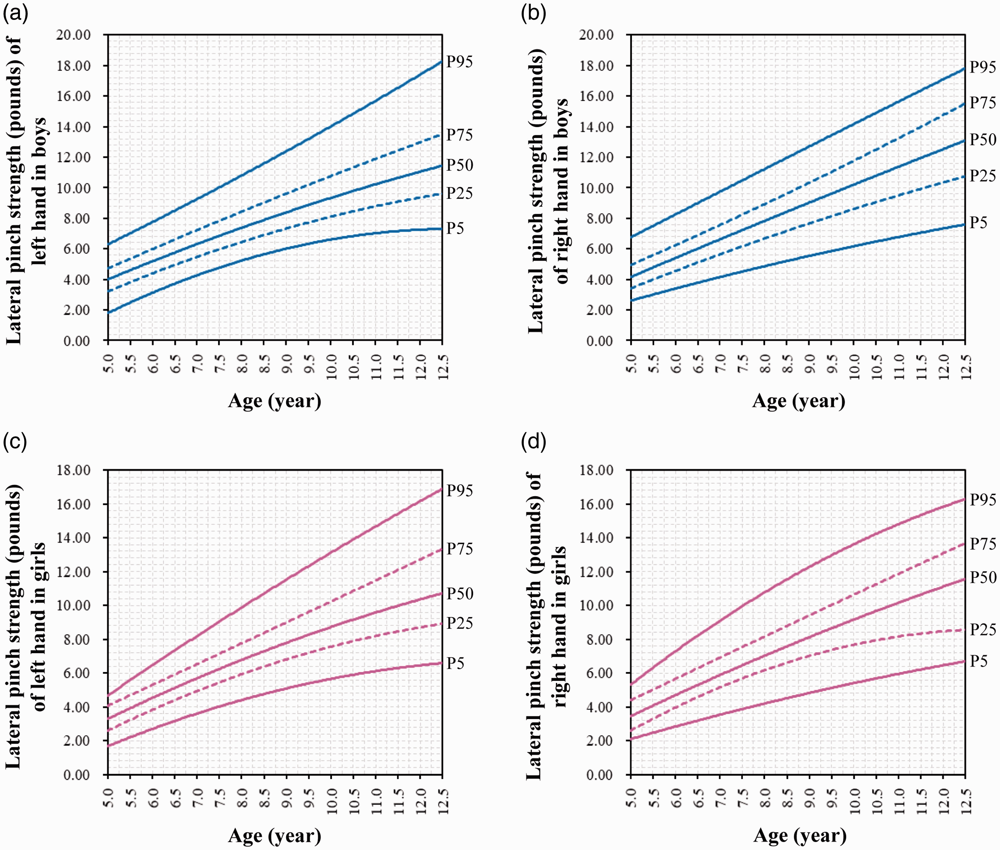
   
  <em>Figuur 4.2: Lateral pinch strength.</em>

Aangezien **elk** kind binnen de doelgroep de ring vlot moet kunnen bedienen, wordt **design for the small** toegepast: het minst krachtige kind (meisje 8.0–8.4 jaar, linkerhand) bepaalt de maximumkracht.

**Berekening:** 7.4 – 1.4 lbs = 6.0 lbs ≈ **2.7 kg**

- **Ontwerpprincipe:** design for the small
- **Maximale knijpkracht:** 2,7 kg

#### Touchpoint 2 — Aanraakscherm

Voor het aanraakscherm werd de **wijsvingerbreedte** (index finger breadth, distal) gebruikt. Bij touch-interfaces wordt **design for the tall** toegepast: de touchpoints moeten groot genoeg zijn zodat ook kinderen met de breedste vingers comfortabel kunnen tikken.

| Leeftijd | Jongens (mm) | Meisjes (mm) |
| --- | --- | --- |
| 7–10 jaar (P95) | 16.3 | 15.7 |
| 11–12 jaar (P95) | 17.5 | 17.0 |

*Bron: Ran, L., Zhang, X., Chao, C., Liu, T., Dong, T. (2009). Anthropometric Measurement of the Hands of Chinese Children. ICDHM 2009.*

> ⚠️ **Beperking van de bron:** de dataset is gebaseerd op Chinese kinderen. Westerse kinderen kunnen iets bredere vingers hebben, dus voor de zekerheid wordt een ruimere marge aangehouden.

- **Ontwerpprincipe:** design for the tall
- **Minimale touchpoint-grootte:** 17,5 mm (+ marge)

#### Touchpoint 3 — Polsband

Voor de polsband werd de **polsdikte** (wrist thickness) opgemeten. Aangezien de band moet meegroeien met het kind én vlot aan en uit moet kunnen, wordt **design for adjustability** toegepast.

| Leeftijd | Jongens (cm) | Meisjes (cm) |
| --- | --- | --- |
| 8.0–8.4 | 3.25 ± 0.42 | 3.01 ± 0.31 |
| 8.5–8.9 | 3.33 ± 0.54 | 3.13 ± 0.35 |
| 9.0–9.4 | 3.34 ± 0.38 | 3.05 ± 0.32 |
| 9.5–9.9 | 3.24 ± 0.33 | 3.18 ± 0.42 |
| 10.0–10.4 | 3.30 ± 0.38 | 3.11 ± 0.39 |
| 10.5–10.9 | 3.36 ± 0.35 | 3.20 ± 0.31 |
| 11.0–11.4 | 3.54 ± 0.47 | 3.34 ± 0.31 |
| 11.5–11.9 | 3.58 ± 0.43 | 3.48 ± 0.41 |

*Bron: Wen J, Wang J, Xu Q, et al. (2020). Hand anthropometry and its relation to grip/pinch strength in children aged 5 to 13 years.*

  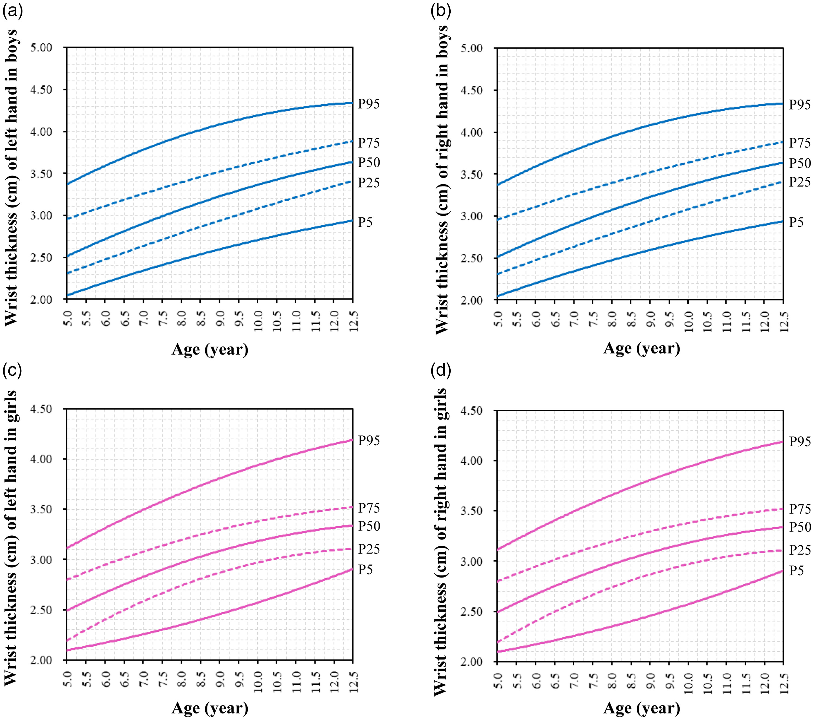
   
  <em>Figuur 4.3: Polsdiktes.</em>

Met inbegrip van standaardafwijkingen loopt de polsdikte van ~2,70 cm (kleinste meisje) tot ~4,01 cm (grootste jongen). De band moet dus minstens dit volledige bereik dekken, met extra marge.

- **Ontwerpprincipe:** design for adjustability
- **Bereik:** minimaal 2,70 cm – maximaal 4,01 cm

### Range of motion

#### Deskresearch gewicht (N=6)

| Horloge | Kinderproduct | Gewicht |
| --- | --- | --- |
| Samsung Galaxy Watch 6 | Nee | 59 g |
| Apple Watch Series 9 | Nee | 31,9 g |
| Garmin Fenix 8 | Nee | 80 g |
| VTech Kidizoom | Ja | 50 g |
| Garmin Vivofit Jr. 3 Marvel | Ja | 25 g |
| Xplora X6 Play | Ja | 58 g |

  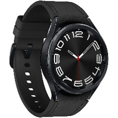
  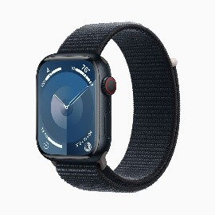
  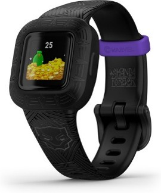
  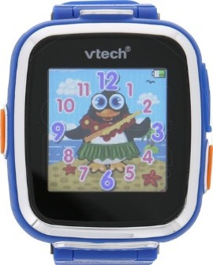
  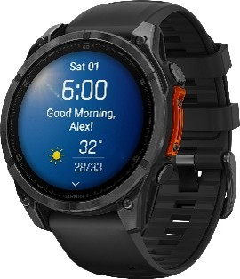
  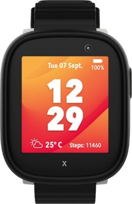
   
  <em>Figuur 4.4: Horloges Deskresearch.</em>

Het gewicht van smartwatches varieert sterk: van 25 g tot 80 g. Specifiek voor kinderhorloges ligt het bereik tussen **25 g en 60 g**.

#### Usertest (N=5)

De test werd uitgevoerd in bibliotheek De Krook met kinderen tussen 9 en 10 jaar. Uit de praktijktest kwamen vier consistente patronen naar voren.

**1. Interactie en bediening**

De **draairing** (rotating bezel) van de Samsung Gear S3 kreeg een unanieme voorkeur boven een standaard touchscreen. Daarnaast werd er specifiek gevraagd naar fysieke knoppen, met voorkeur voor een grotere knop aan de linkerkant.

**2. Schermgrootte en vormfactor**

Een **slanke, Fitbit-achtige vormfactor** wordt door meerdere kinderen als aantrekkelijk en comfortabel ervaren. Grote prototypes worden snel als *"lomp en oncomfortabel"* ervaren rond een dunne kinderpols. Eén deelnemer week af en gaf de voorkeur aan een groter scherm; voor één andere maakte het niet uit.

**3. Polsbandjes**

De polsomtrek van de doelgroep vereist **zeer kleine bandjes**: alle respondenten moesten de Gear S3 dragen op de kleinste, op één na kleinste of op twee na kleinste stand. Het comfort van het bandje blijkt cruciaal voor de acceptatie van het totale gewicht.

**4. Gewicht — de paradox tussen theorie en praktijk**

Dit is de meest opvallende bevinding uit de test:

| Setting | Voorkeur | Reden |
| --- | --- | --- |
| Losse gewichtjes (theoretisch) | Lichtste gewicht | Bewegingsvrijheid, *"voelt alsof je niets aanhebt"* |
| Werkend horloge (praktijk) | Zwaarder (Gear S3, 59 g) | *"Beter"*, *"premium"*, *"steviger"* |

De extra respondent (Lars) bevestigde: *"een iets zwaarder horloge voelt meer premium en steviger aan."* Emma vormde de uitzondering, voor haar was de Gear S3 te zwaar voor continu gebruik.

> **Conclusie:** een klein scherm en een kleine band, maar met een relatief zwaarder gewicht (richting ~59 g) wordt als optimaal ervaren.

### Sensoriële ergonomie — zien

De referentielettergrootte voor leesbare tekst bij kinderen van 8–12 jaar werd afgeleid uit kinderboeken voor deze leeftijdscategorie. Geanalyseerde boeken: *Geronimo Stilton — Alice in Wonderland* en *Roald Dahl — De Heksen*.

  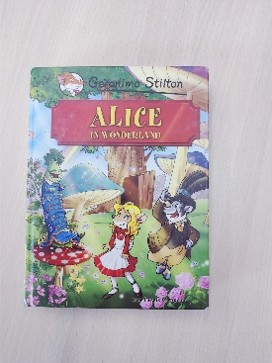
  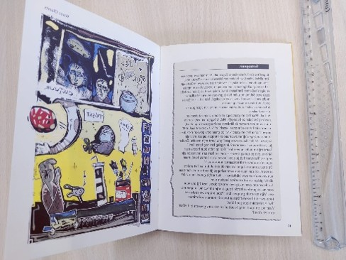
  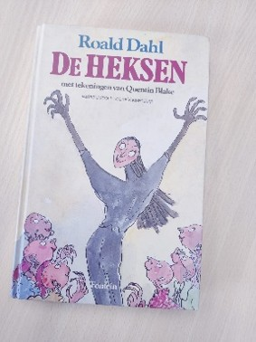
  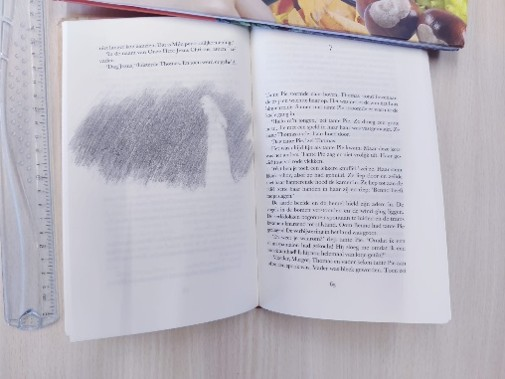
   
  <em>Figuur 4.5: refererentieboeken</em>

- **Lettergrootte:** 14–16 pt voor 8–12 jaar
- *Bron: [boekenmakers.nl](https://www.boekenmakers.nl/artikel/hoe-kies-je-de-juiste-lettergrootte-voor-boeken/)*

## Kritische reflectie

Het originele opzet van deze Develop II was om een eerste prototype van het **volledige ZUÏN-systeem** te testen. Vijf gezinnen zouden gedurende twee dagen met een hub en wearable interageren, om zowel het herhaaldelijk gebruik als een eventuele eerste gedragsverandering te observeren.

Dit idee werd verworpen omwille van twee redenen:
- Er waren problemen met de conectiveit tussen de twee toestellen. Achteraf bleek dat er iets mis was met de microcontrollers. Dit werd zeer laat in het project ontdekt waardoor de tests zijn weggevallen.
- Er zou geen tijd meer zijn om genoeg data te verzamelen (vijf gezinnen twee dagen lang laten testen) om tot een reële conclusie te komen. Kinderen gaan in de week naar school en ouders werken, waardoor alleen in de weekenden of vakanties getest zou kunnen worden. Enerzijds om genoeg data te kunnen verkrijgen, anderzijds omdat het voor ouders ook doorgaans beter past in de weekenden. 

Een beperking van de huidige fase is dat de usertest met N=5 kwalitatief van aard blijft en dat de antropometrische bronnen deels gebaseerd zijn op een niet-Westerse populatie (Chinese kinderen voor de vingerbreedte). Voor het verdere ontwerp werd hier marge op toegelaten.
