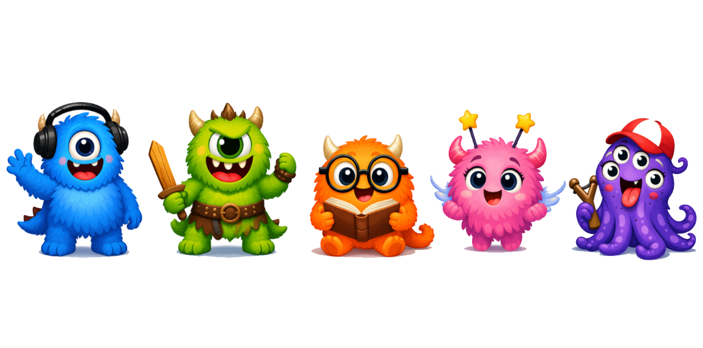
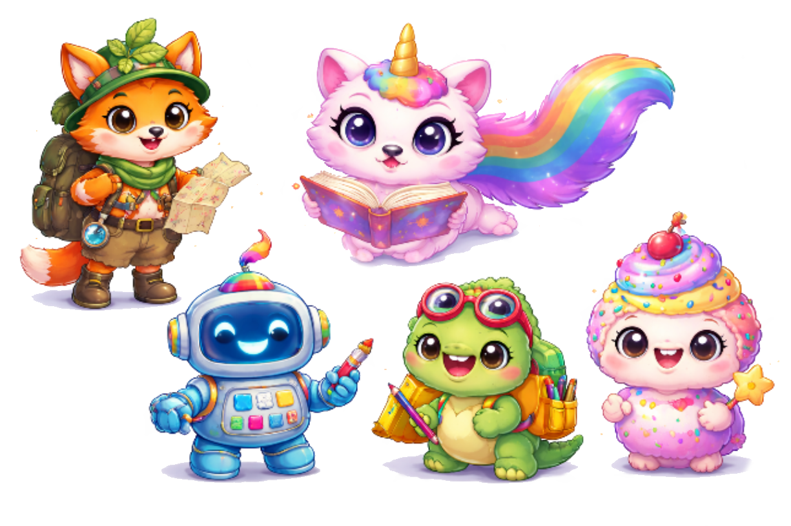
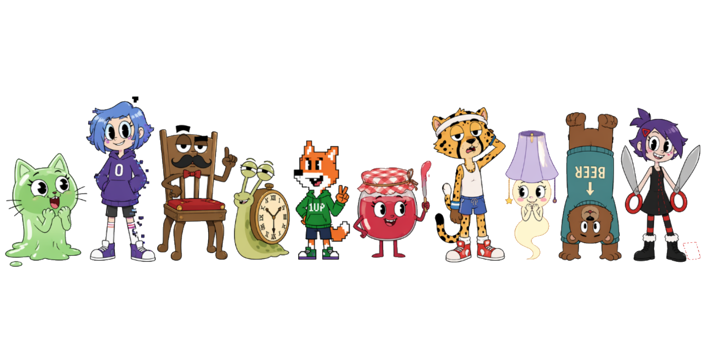
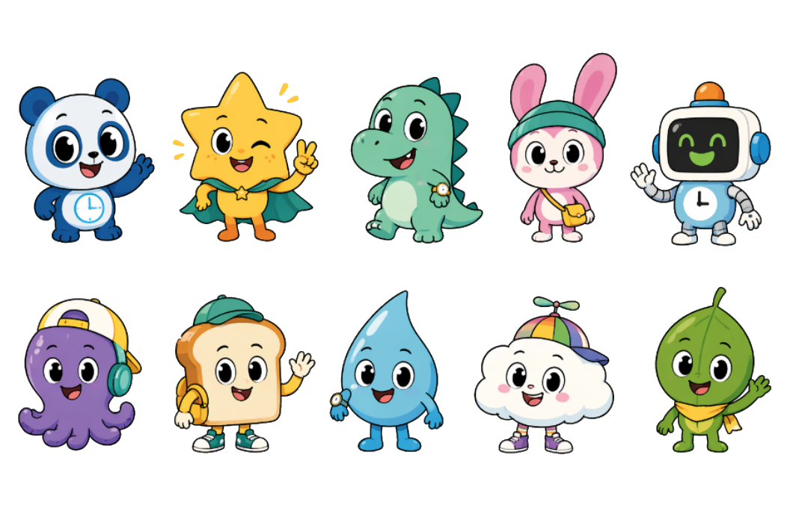
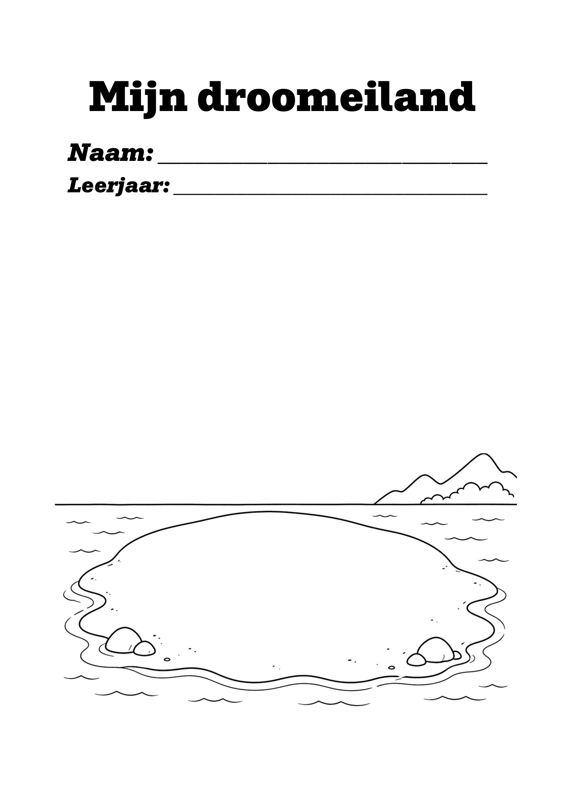

# Develop III

## Doelstellingen

In deze fase wordt het ontwerp verder verfijnd langs twee grote assen: de **UX & Service Design** en de **CMF (Colour, Material & Finish)**. Het doel is om het product emotioneel betekenisvol te maken voor de doelgroep en de materiaalkeuzes te onderbouwen vanuit gebruikersonderzoek.

Concreet wordt onderzocht:
- Welke emoties het product moet oproepen bij kinderen en ouders
- Hoe de mascotte, de interface-eilanden en de micro-interacties het beste worden vormgegeven
- Welke materialen, afwerkingen en tactiele eigenschappen kinderen verkiezen voor het horloge

## Materiaal & methoden

### UX & Service Design (N=5)

Om de UX te onderbouwen werd een combinatie van methodes ingezet:

- **Emotioneel ontwerp**: opstellen van een emotionele doelstellingenkaart voor ouders en kinderen als ontwerpkader
- **Deskresearch** (literatuur rond antropomorfisme, parasociale relaties bij kinderen, UI-design voor 8–12-jarigen)
- **Interview (N=5)**: kinderen uit het 4e leerjaar (Basisschool Klim-Op Grobbendonk, 30/04/2026) — personage-sorting, vriendenboek en quote-koppeling
- **Droomeiland-oefening**: twee klassen (4e en 5e leerjaar) ontwerpen hun droomeiland als input voor de eiland-thema's
- **Benchmarkanalyse** van kindvriendelijke apps, sites en tv-programma's (Ketnet, Subway Surfer, Animal Crossing, Roblox, Disney)
- **Customer journey** en **service blueprint** als service design instrumenten

### CMF (N=3)

Om de materiaalkeuzes te onderbouwen werden usability tests afgenomen met kinderen uit de Woudlopertak van de scouts (9–12 jaar) op zondag 10 mei 2026. De test was opgedeeld in 3 boards, elk met een ander CMF-aspect. De kinderen beoordeelden elk artefact op een 7-punts Likertschaal (1 = zeer slecht → 7 = zeer goed), stelden een persoonlijke voorkeursvolgorde op en gaven een korte motivering.

- **Board 1**: vier bandjes (stalen horloge, smartwatch, groot horloge, roze synthetisch leer) — aanvoelen rond de pols
- **Board 2**: vier horlogebehuizingen (2A–2D) — visuele en tactiele beoordeling van afwerking en knoppen
- **Board 3**: vier 3D-geprinte prototypes (3A–3D) met verschillende ribprofielen op de draaibare ring — haptische kwaliteit

## Resultaten

### UX & Service Design (N=5)

#### Emotioneel ontwerp

Het emotioneel ontwerp vertrekt vanuit de vraag: *"Welke emoties moet het product oproepen?"* Dit vormt het kader voor alle verdere ontwerpbeslissingen.

| Gebruiker | Gewenste emotie | Ontwerpimplicatie |
| --- | --- | --- |
| Ouders | Trots | Kind leert zelfstandig over verbruik |
| Ouders | Opluchting | Minder discussie ("doe het licht uit!") |
| Ouders | Samenwerking | Ouder en kind samen, niet tegenover elkaar |
| Kinderen | Autonomie | Kind beslist zelf om minder te verbruiken |
| Kinderen | Uitdaging | Beter doen dan gisteren |
| Kinderen | Verbondenheid | Met ouders én met de virtuele vriend |
| Kinderen | Trots | Iets goed doen zonder dat ouders erachter zitten |
| Kinderen | Begrip | Meer leren over verbruik |

> ⚠️ **Valkuil**: schuldgevoel ("Ik verbruik te veel") moet ten allen tijde vermeden worden. Dit stuurt de keuze voor positieve, motiverende feedback in de interface en bij de mascotte.

#### Deskresearch

Uit literatuur rond antropomorfisme en parasociale relaties bij kinderen (o.a. ACM CHI 2024) blijkt:
- Kinderen leren beter wanneer ze een band opbouwen met een personage
- Een combinatie van universele personages (monsters) én herkenbare figuren werkt het best
- Neutrale personages alleen zijn onvoldoende: kinderen moeten ook personages zien die op henzelf lijken

Voor de interface werd een benchmarkanalyse uitgevoerd van Ketnet, Subway Surfer, Cut the Rope, Animal Crossing, Roblox en Disney, aangevuld met de 12 Disney animatieprincipes voor UI-design.

Op basis van de deskresearch werden via AI (ChatGPT) verschillende reeksen personages gegenereerd die als testmateriaal dienden tijdens de interviews. De reeksen varieerden in stijl: van schattige dieren en objecten tot monsters en meer volwassen Gumball-geïnspireerde figuren.

  

  

  

  

Uit deskresearch en benchmarkanalyse vloeiden volgende design requirements voort:

| # | Design requirement | Bron |
| --- | --- | --- |
| 01 | De mascotte combineert universele herkenbaarheid met voldoende variatie | Literatuur |
| 02 | Alles wat lijkt op een knop moet ook een functie uitvoeren | Benchmark |
| 03 | Knoppen minimaal 2×2 cm, voldoende ruimte ertussen | Deskresearch |
| 04 | Zo weinig mogelijk tekst; iconen en symbolen vanzelfsprekend | Benchmark |
| 05 | Directe feedback (visueel, auditief of haptisch) bij elke interactie | Benchmark |
| 06 | Maximaal 3–5 keuzes per scherm | Deskresearch |
| 07 | Lettergrootte > 14pt, eenvoudige taal, actieve zinnen | Deskresearch |
| 08 | Grote iconen (60×60 tot 80×80 pixels) | Deskresearch |
| 09 | Interface mag geen schuldgevoel opwekken, enkel motiveren | Emotioneel ontwerp |

#### Interview (N=5)

| Kind | Leerjaar | Datum | Plaats |
| --- | --- | --- | --- |
| Mila | 4 | 30/04/2026 | Basisschool Klim-Op Grobbendonk |
| Jana | 4 | 30/04/2026 | Basisschool Klim-Op Grobbendonk |
| Sterre | 4 | 30/04/2026 | Basisschool Klim-Op Grobbendonk |
| Jarne | 4 | 30/04/2026 | Basisschool Klim-Op Grobbendonk |
| Simon | 4 | 30/04/2026 | Basisschool Klim-Op Grobbendonk |

Uit het vriendenboek en de sorting-oefening kwamen 5 personagetypes naar voren:

| Type | Kenmerken | Voorbeeldpersonages |
| --- | --- | --- |
| Betrouwbaar / zacht | Vriendelijk, sociaal veilig, niet bedreigend | Blaadje, Grote Ster, Panda |
| Sociaal / speels | Actief, nieuwsgierig, extravert | Vosje, Konijntje, Avonturier |
| Chaotisch / impulsief | Grappig, speels chaotisch, comic relief | Monsters (Blauw monster, Octo) |
| Stoer / assertief | Zelfzeker, territoriaal | Draco, Draakje, Drilly |
| Neutraal / slim | Betrouwbaar maar minder emotioneel warm | Robotje, AI-kleurrobot |

Quotes die kinderen koppelden aan de meest vertrouwde personages illustreren welk type het beste past bij de rol van begeleider/coach in het horloge:

> *"Gaan we samen spelen?"* → Blaadje, Robotje, Draco

> *"Goed bezig!"* → Henk, Louise, Fristi

> *"Ik heb een geheim, maar je mag dit aan niemand vertellen."* → Blaadje, Grote Ster, Louise

Personages werden verworpen als vriend wanneer ze een object bij hadden: *"Die kan mijn geheim opschrijven in zijn boek"*, *"Die heeft een zwaard bij"*. Dit toont aan dat de context rond een personage even zwaar weegt als het uiterlijk zelf.

De visuele kenmerken die vertrouwen opwekken:

| Kenmerk | Vertrouwen | Wantrouwen |
| --- | --- | --- |
| Vorm | Rond, afgerond | Scherp, hoekig |
| Ogen | Groot, open | Klein, half dicht |
| Proporties | Groot hoofd, klein lichaam | Menselijke proporties |
| Details | Eenvoudig | Druk, veel details |
| Kleur | Blauw/groentinten | — |

**Design requirement (10):** de mascotte heeft ronde vormen, grote ogen, een groot hoofd ten opzichte van het lichaam en een eenvoudig kleurenpallet in blauw/groentinten.

Voor de eiland-thema's leverden twee klassen (4e en 5e leerjaar) input via een droomeiland-oefening. De kinderen kregen een leeg eiland-template en mochten dit naar eigen fantasie invullen. De meest voorkomende elementen waren glijbanen, hoge gebouwen en dieren. Deze worden verwerkt in de eilandthema's en via Vizcom visueel uitgewerkt.

  

### CMF (N=3)

Om de kinderen te rekruteren werd een flyer uitgedeeld aan de Woudlopers na afloop van hun activiteit op 2 mei. De test zelf vond plaats op zondag 10 mei om 13u30 op de scouts.

  

| Deelnemer | Leeftijd | Datum | Locatie |
| --- | --- | --- | --- |
| Melvin | 9–12 | 10/05/2026 | Scouts – Woudlopers |
| Lisa | 9–12 | 10/05/2026 | Scouts – Woudlopers |
| Soni | 9–12 | 10/05/2026 | Scouts – Woudlopers |

#### Board 1 – Bandmateriaal (N=3)

De vier bandartefacten zijn een klassiek stalen horloge-bandje, een zachte siliconenband van een smartwatch, het bandje van een groot digitaal horloge en een synthetisch lederen bandje (roze). De kinderen droegen elk bandje om de pols en beoordeelden het op aanvoelen.

| Deelnemer | Stalen horloge | Smartwatch | Groot horloge | Roze bandje | Voorkeur |
| --- | --- | --- | --- | --- | --- |
| Melvin | 7/7 | 1/7 | 2/7 | 1/7 | 1. Stalen horloge |
| Lisa | 6/7 | 6/7 | 7/7 | 5/7 | 1. Groot horloge |
| Soni | 6/7 | 6/7 | 2/7 | 7/7 | 1. Roze bandje |
| **Gemiddeld** | **6.3/7** | **4.3/7** | **3.7/7** | **4.3/7** | |

Het stalen horloge-bandje scoort het meest consistent (gemiddeld 6,3/7) en wordt door geen enkele deelnemer laag beoordeeld. Melvin omschrijft het als *"koud en zwaar"*, wat aansluit bij eerder onderzoek waarin een zeker gewicht als 'premium' wordt ervaren. Het roze synthetisch leren bandje toont de grootste spreiding (1–7/7) en is daarmee het meest polariserend.

**Conclusie board 1:** het stalen of metaal-look bandje verdient de voorkeur als standaardoptie; synthetisch leer kan als aanpasbare variant worden aangeboden.

#### Board 2 – Afwerking & finish behuizing (N=3)

Vier horloges met verschillende afwerkingen (glans, mat, geborsteld, knoppen-detail) werden naast elkaar geplaatst. De kinderen mochten de horloges vasthouden en bekijken maar niet omdoen. De focus lag op het visuele en tactiele oordeel over de behuizing en de knoppendetaillering.

| Deelnemer | Horloge 2A | Horloge 2B | Horloge 2C | Horloge 2D | Voorkeur |
| --- | --- | --- | --- | --- | --- |
| Melvin | 6/7 | 7/7 | 4/7 | 2/7 | 1. Horloge 2B |
| Lisa | 5/7 | 4/7 | 6/7 | 6/7 | 1. Horloge 2B |
| Soni | 5/7 | 2/7 | 7/7 | 5/7 | 1. Horloge 2C |
| **Gemiddeld** | **5.3/7** | **4.3/7** | **5.7/7** | **4.3/7** | |

Horloge 2C heeft het hoogste Likert-gemiddelde (5,7/7), maar horloge 2B wordt door 2 van de 3 deelnemers als eerste gekozen. Melvin en Lisa benadrukken het speelse knoppen-detail: *"Omdat er leuke puntjes in de knoppen zitten"*, *"leuke knoopjes, veel knopjes"*. Horloge 2D scoort zowel in Likert als ranking consequent het laagst.

**Conclusie board 2:** horloge 2B-stijl (knoppen-detaillering) is de aanbevolen primaire finish-richting; horloge 2C-stijl (cleane afwerking) is een geschikt alternatief. Horloge 2D wordt afgeraden.

#### Board 3 – Tactiele ring (N=3)

Vier 3D-geprinte prototypes (3A–3D) met elk een ander ribprofiel en een andere weerstand op de draaibare ring werden beoordeeld op haptische kwaliteit. De kinderen draaiden aan alle vier de ringen.

| Deelnemer | Ring 3A | Ring 3B | Ring 3C | Ring 3D | Voorkeur |
| --- | --- | --- | --- | --- | --- |
| Melvin | 1/7 | 3/7 | 7/7 | 4/7 | 1. Ring 3C |
| Lisa | 7/7 | 5/7 | 4/7 | 6/7 | 1. Ring 3A |
| Soni | 3/7 | 5/7 | 7/7 | 4/7 | 1. Ring 3C |
| **Gemiddeld** | **3.7/7** | **4.3/7** | **6.0/7** | **4.7/7** | |

Ring 3C springt er sterk uit: het hoogste gemiddelde (6,0/7) en de voorkeur van 2 van de 3 deelnemers. Melvin motiveert: *"Omdat je er goed aan moet draaien en het niet zo rap draait"* — een gedoseerde weerstand die bewuste bediening vereist. Lisa vormt een uitzondering en verkiest ring 3A: *"Het is niet te hard, maar anders vind ik het ook goed."*

**Conclusie board 3:** ring 3C wordt aanbevolen als uitgangspunt voor het definitieve ringprofiel. Ring 3A kan als lichtere variant worden overwogen.

#### Algemene aanbevelingen

| Onderdeel | Aanbeveling | Alternatief |
| --- | --- | --- |
| Bandje | Stalen / metaal-look | Synthetisch leer (aanpasbaar) |
| Behuizing-finish | Knoppen-detaillering (2B-stijl) | Cleane afwerking (2C-stijl) |
| Tactiele ring | Ringprofiel 3C (gedoseerde weerstand) | Ring 3A (lichtere weerstand) |

