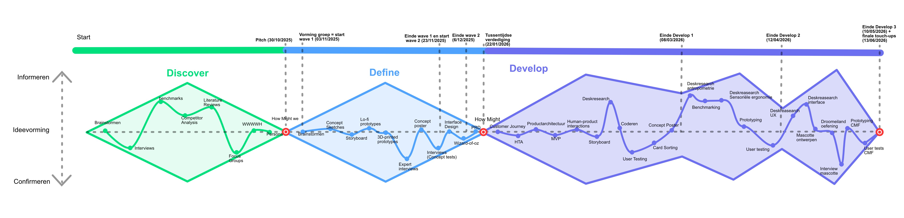

## Methodologie
In dit onterwerpproces werd het **Tripel Diamond model gevolgd**. Hierin stelt de eerste diamond de **discovery-fase** voor, de tweede diamond staat voor de **definition-fase** en de derde diamond wordt in het tweede semester uitgewerkt als een **develop- en deliver-fase**.

  
   
  <em>Figuur 1: Triple Diamond-ontwerpproces: Discover, Definition en Develop & Deliver.</em>

<ins>**Discover**</ins>  
De discoveryfase richtte zich op het begrijpen van hoe mensen binnen het huishouden omgaan met energieverbruik en welke impact dit heeft op hun dagelijks leven. De focus lag op bewustzijn, gedrag en de rol van kinderen als onbewuste energieverbruikers.

Via **interviews (N=3)** werd nagegaan hoe bewust gezinnen omgaan met hun energieverbruik en welke triggers hen motiveren om te besparen. Dit werd aangevuld met een **benchmarkanalyse (N=10)** van bestaande slimme energieoplossingen en **deskresearch (N=6)** naar de grootste energieverbruikers in het huishouden. Hieruit bleek dat energieverbruik voor de meeste mensen onzichtbaar en verwarrend is, bestaande oplossingen te complex en te datagericht zijn, en dat kinderen onvoldoende betrokken worden bij energiebesparing. Er werd geconcludeerd dat er nood is aan een eenvoudige, visuele en kindvriendelijke manier om energieverbruik zichtbaar te maken en duurzaam gedrag te stimuleren.

<ins>**Definition**</ins>  
De definitionfase werd opgesplitst in twee waves.

**Wave 1** onderzocht welk productconcept kinderen het meest aanspreekt. Na het opstellen van een storyboard werden drie quick-and-dirty prototypes (knuffelbeer, horloge en tamagotchi-console) getest via **user feedback sessions (N=5)** en **dot-voting** op de Dag van de Wetenschap. Voorafgaand werd afgetoetst met een expert van Comon, die bevestigde dat kinderen vanaf 5 jaar al gehoord hebben van energieverbruik en dat gamification slechts 2–4 weken werkt zonder betekenisvolle interactie. Het horloge kwam als duidelijke favoriet naar voren: draagbaar, altijd bij het kind, en geschikt voor directe visuele feedback. Ouders stonden positief tegenover het educatieve doel, maar uitten bezorgdheden rond afval, prijs en onnodige hardware.

**Wave 2** richtte zich op de interface en informatie-architectuur. Drie interface-varianten werden getest via **Wizard-of-Oz-testing (N=5)** met het **Think Aloud Protocol** in De Krook. Kinderen voerden per interface drie taken uit: een kamer met hoog verbruik identificeren, het fantasie-eiland vinden en een verhaaltje opzoeken. Herhaling had een sterke positieve invloed op begrip en zelfstandigheid, maar de informatie-architectuur bleek structureel onduidelijk en de tekstgrootte te klein. Visuele eenvoud, grotere tekst en een duidelijkere navigatie werden daarom belangrijke ontwerpprincipes.

<ins>**Develop**</ins>  
De developfase werd opgesplitst in drie waves.

**Wave 1** richtte zich op het aanscherpen van de kernfunctionaliteit en het opbouwen van een systeemanalyse. Via een **customer journey**, **HTA**, **productarchitectuur** en **MVP-analyse** werd het ZUIN-concept technisch en functioneel uitgewerkt. Een **benchmarkanalyse** van smartwatches voor volwassenen (N=4), kinderen (N=3) en habit apps (N=4) leverde ontwerprichtlijnen op voor kindvriendelijke interactie: fysieke knoppen en een draairing, ondiepe informatiehiërarchie, gamification en visuele progressie. Via **semi-gestructureerde interviews met ouders (N=5)**, aangevuld met **card sorting**, werd de koopbereidheid en gewenste functionaliteit onderzocht. Ouders bleken energiebesparing belangrijk te vinden maar er zelden actief mee bezig te zijn; kinderen worden weinig betrokken, maar ouders zien daar wel potentieel in.

**Wave 2** verschoof de focus naar de ergonomische en antropometrische onderbouwing van het horloge. De drie touchpoints — draaiknop, aanraakscherm en polsband — werden onderbouwd via **literatuurstudie** naar laterale knijpkracht, wijsvingerbreedte en polsdikte bij kinderen van 8–12 jaar. Een **deskresearch (N=6)** vergeleek het gewicht van bestaande kinder- en volwassen smartwatches. Tijdens een **usertest (N=5)** in bibliotheek De Krook testten kinderen drie 3D-geprinte prototypes en een referentiehorloge (Samsung Gear S3). De meest opvallende bevinding was de paradox tussen theorie en praktijk: bij losse gewichtjes kozen kinderen het lichtste, maar bij een werkend horloge verkozen ze het zwaardere model (~59 g) omdat het als premium en steviger werd ervaren. Een slanke vormfactor met een klein scherm, een kleine band en een relatief zwaarder gewicht werd als optimaal ervaren.

**Wave 3** verfijnde het ontwerp langs twee assen: **UX & Service Design** en **CMF (Colour, Material & Finish)**. Voor de UX werd een emotioneel ontwerpkader opgesteld, aangevuld met **deskresearch** rond antropomorfisme en parasociale relaties bij kinderen. Via **interviews met kinderen (N=5)** in Basisschool Klim-Op Grobbendonk werd de mascotte gevalideerd door middel van personage-sorting, een vriendenboek en een quote-koppelingsoefening. Twee klassen leverden input via een **droomeiland-oefening** voor de interface-eilanden. Een **customer journey** en **service blueprint** brachten het volledige gebruikstraject in kaart. Voor de CMF werden **usability tests (N=3)** afgenomen bij Scouts-Woudlopers (9–12 jaar), waarbij drie boards — bandmateriaal, behuizingsafwerking en tactiele ring — werden beoordeeld via Likertschalen en voorkeurrangschikking. Hieruit bleek een voorkeur voor een metaal-look bandje, knoppen-detaillering op de behuizing en een ringprofiel met gedoseerde weerstand.