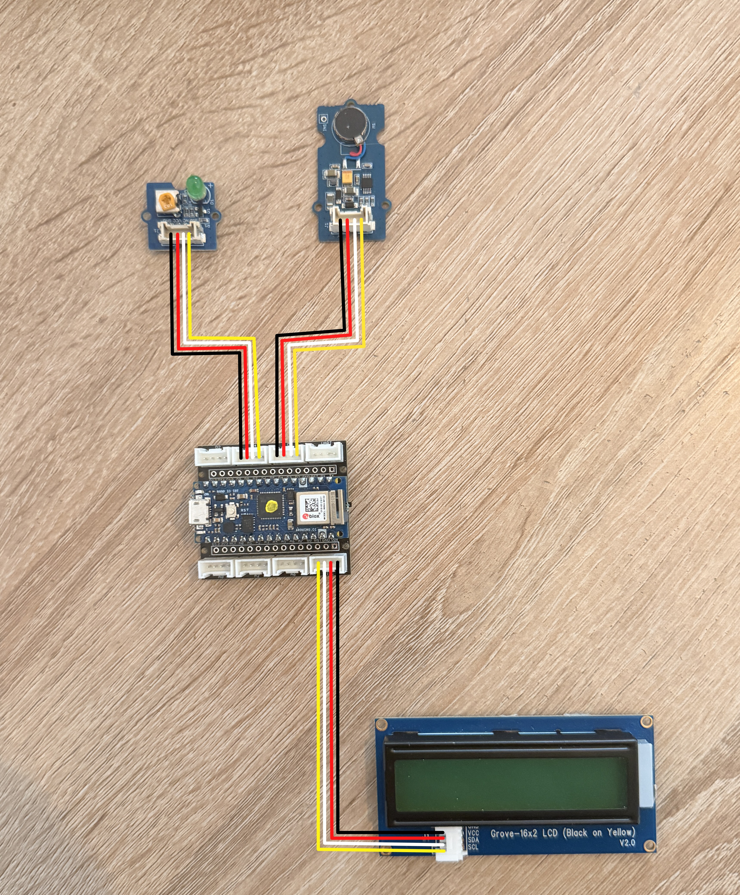
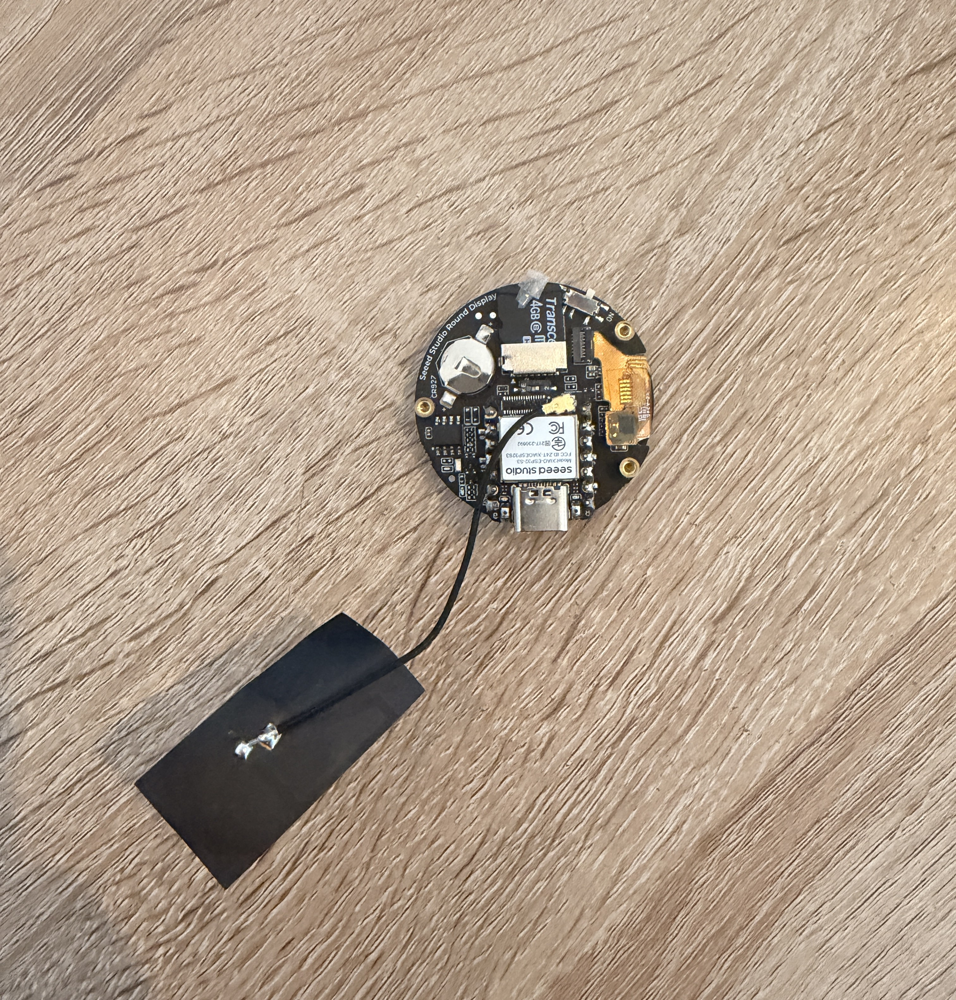

# ZUIN — Software
  
## Introductie
 
ZUIN is een systeem van interactieve producten dat kinderen en ouders helpt bewuster om te gaan met energieverbruik thuis. Het systeem bestaat uit twee hardware-onderdelen: een **hub** en een **handheld**. De hub staat centraal in de woning en communiceert draadloos via Bluetooth Low Energy (BLE) met de handheld, die het kind draagt als een horloge.
 
Wanneer de hub detecteert dat een apparaat in huis energie verbruikt, stuurt hij een signaal naar de handheld. Het kind wordt hiervan op de hoogte gebracht via trillingen, een LED en een schermmelding. Door naar de hub te gaan en op de knop te drukken, leert het kind actief om apparaten uit te zetten.
  
De software van dit project is opgesplitst in twee delen:
 
- **Hub** — een Arduino-gebaseerd systeem dat BLE-signalen uitzendt en de interactie met de knop verwerkt.
- **Handheld** — in twee versies ontwikkeld. Versie 1 is een minimalistisch prototype met een LCD-scherm en haptic feedback. Versie 2 is een verbeterde versie met een rond kleurentouchscreen, een grafische LVGL-interface en een echte RTC-klok.

---
 

## Opstarten van de code
 
De code is opgesplitst in drie mappen: één voor de hub, één voor handheld v1 en één voor handheld v2.
 
### Hub
 
Om de hub op te starten, open je [`code_hub`](./codes/HUB/code_hub) in de Arduino IDE. Zorg dat de volgende libraries geïnstalleerd zijn:
 
- `ArduinoBLE`
- `rgb_lcd` (Grove LCD library)
- `Wire`
Upload de code naar het Arduino-bordje. Bij het opstarten toont het LCD-scherm "ZUIN HUB" en begint het bordje te adverteren als `ZuinHub` via BLE.
 
### Handheld v1
 
Open [`code_handheld_V1`](./codes/HANDHELD_V1/code_handheld_V1) in de Arduino IDE. Zorg dat de volgende libraries geïnstalleerd zijn:
 
- `ArduinoBLE`
- `rgb_lcd` (Grove LCD library)
- `Wire`
Upload de code naar het Arduino-bordje. De handheld scant automatisch naar de hub en verbindt zodra `ZuinHub` gevonden wordt.
 
### Handheld v2
 
Open [`code_handheld_v2`](./codes/HANDHELD_V2/code_handheld_v2) in de Arduino IDE. Dit project maakt gebruik van meerdere gegenereerde bestanden vanuit SquareLine Studio die zich bevinden in de map [`extra_bestanden_interface/`](./codes/HANDHELD_V2/extra_bestanden_interface). Zorg dat deze map samen met het hoofdbestand gebruikt wordt. De volgende libraries zijn vereist:
 
- `TFT_eSPI`
- `lvgl`
- `I2C_BM8563` (RTC)
- `BLEDevice`, `BLEUtils`, `BLEScan`, `BLEClient` (ESP32 BLE stack)
- `lv_xiao_round_screen`
- `Wire`
Upload de code naar de Seeed XIAO ESP32S3. Het scherm toont bij het opstarten de huidige tijd en de handheld begint automatisch te scannen naar `ZuinHub`.
 
---
 
## Functioneel schema
 
Onderstaand schema toont de volledige logica van het systeem: links de hub, rechts de handheld. De groene stippellijnen geven de BLE-communicatie weer tussen beide apparaten.
 

  

---

## Validatie inputs

### Knop (Hub)

De hub bevat een drukknop die de gebruiker (het kind) in staat stelt om aan te geven dat een apparaat uitgeschakeld is. De knop is verbonden op pin 2 van het Arduino-bordje. Wanneer de knop ingedrukt wordt terwijl een signaal actief is, roept de hub de functie `turnOffDevice()` aan. Het LCD-scherm toont vervolgens welk apparaat uitgeschakeld werd.

  

De code maakt gebruik van de `digitalRead()` functie van de standaard Arduino library.

### Touchscreen (Handheld v2)

De handheld v2 maakt gebruik van een capacitief touchscreen dat geïntegreerd is op de Seeed XIAO round display. Aanrakingen worden uitgelezen via de `chsc6x_get_xy()` functie uit de `lv_xiao_round_screen` driver. De touchcoördinaten worden doorgegeven aan LVGL via een input device driver (`lv_indev_drv_t`).

Wanneer een kind op de knop van de hub duwt, wordt dit via een LVGL event callback (`LV_EVENT_CLICKED`) verwerkt en verdwijnt het vlammetje.

  

---

## Validatie outputs

### LCD-scherm 16x2 (Hub & Handheld v1)

Zowel de hub als handheld v1 maken gebruik van een Grove RGB LCD-scherm met 16 kolommen en 2 rijen. Dit scherm toont de huidige toestand van het systeem in leesbare tekst.

**Hub:** toont bij opstart "ZUIN HUB", daarna "Wachten..." tijdens idle, "Apparaat aan! / Druk om uit" bij een actief signaal, en "Uitgezet: [apparaat]" na bevestiging.

**Handheld v1:** toont "ZUIN HANDHELD" tijdens idle, en "Apparaat aan! / Ga naar hub!" wanneer een signaal ontvangen wordt.

  

De code maakt gebruik van de `rgb_lcd` library voor aansturing van het scherm via I2C.

### Rond TFT-kleurentouchscreen (Handheld v2)

De handheld v2 gebruikt een rond TFT-display van 240x240 pixels, aangestuurd via de `TFT_eSPI` library in combinatie met LVGL. De UI-schermen zijn ontworpen in SquareLine Studio en gegenereerd als C-bronbestanden (`ui_Screen1.c` t.e.m. `ui_Screen4.c`).

- **Screen 1** — hoofdscherm met lopende klok (via RTC)
- **Screen 2, 3, 4** — elk een ander vlammetje dat verschijnt bij een energiesignaal

  
  

De drie vlammetjes zijn opgeslagen als gecompileerde C-afbeeldingsbestanden (`ui_img_761137763.c`, `ui_img_1057345124.c`, `ui_img_1448235480.c`) en een achtergrond van een eiland (`ui_img_palm_trees_and_island_png_clipart_imag...c`).

### LED (Hub & Handheld v1)

**Hub:** twee LEDs geven de toestand van het systeem aan. De idle-LED (pin 6) brandt wanneer het systeem wacht. De action-LED (pin 4) brandt wanneer een signaal actief is.

**Handheld v1:** één LED op pin 4 licht op wanneer een signaal ontvangen wordt van de hub.

   
  

De LEDs worden aangestuurd via `digitalWrite()`.

### Haptic motor (Handheld v1)

De handheld v1 bevat een haptic motor op pin 6. Wanneer een signaal ontvangen wordt, trilt de motor drie keer kort (`300ms aan, 200ms uit`). Dit geeft het kind een tastbare melding zonder dat het naar het scherm hoeft te kijken.

  

### RTC-klok (Handheld v2)

De handheld v2 bevat een I2C BM8563 RTC-module die de huidige tijd bijhoudt. De tijd wordt elke seconde uitgelezen en weergegeven op het hoofdscherm via een LVGL label (`ui_ClockLabel`). De RTC is verbonden via SDA (pin 5) en SCL (pin 6).

  

De code maakt gebruik van de `I2C_BM8563` library.

---

## BLE communicatie

De hub en handheld communiceren draadloos via **Bluetooth Low Energy (BLE)**. Beide apparaten gebruiken dezelfde service- en characteristic-UUID's:

- **Service UUID:** `95ff7bf8-aa6f-4671-82d9-22a8931c5387`
- **Characteristic UUID:** `95ff7bf8-aa6f-4671-82d9-22a8931c5388`

De hub fungeert als **peripheral**: hij adverteert zich als `ZuinHub` en schrijft `"SIGNAL"` of `"IDLE"` naar de characteristic.

De handheld fungeert als **central**: hij scant naar `ZuinHub`, verbindt, en subscribet op de characteristic via notify. Bij disconnect herverbindt de handheld automatisch (elke 5 seconden opnieuw scannen).

| Waarde | Betekenis |
|--------|-----------|
| `"SIGNAL"` | Een apparaat verbruikt energie — kind moet actie ondernemen |
| `"IDLE"` | Apparaat uitgeschakeld — systeem terug in rust |

---

## Handheld v1 vs v2

| Eigenschap | Handheld v1 | Handheld v2 |
|---|---|---|
| Microcontroller | Arduino (ArduinoBLE) | Seeed XIAO ESP32S3 |
| Scherm | 16x2 LCD tekst | Rond 240x240 TFT kleurentouchscreen |
| UI | Tekstueel | LVGL grafische interface (SquareLine Studio) |
| Klok | ❌ | ✅ RTC (BM8563) |
| Feedback | LED + haptic motor (3x trillen) | Visuele vlammetjes op scherm |
| Touch | ❌ | ✅ Capacitief touchscreen |
| BLE library | `ArduinoBLE` | `BLEDevice` (ESP32 stack) |

---

## Gebruikte libraries

### Hub & Handheld v1

| Library | Functie |
|---------|---------|
| `ArduinoBLE` | Bluetooth Low Energy communicatie |
| `rgb_lcd` | Aansturing Grove RGB LCD-scherm via I2C |
| `Wire` | I2C communicatie |

### Handheld v2

| Library | Functie |
|---------|---------|
| `TFT_eSPI` | Aansturing TFT-display via SPI |
| `lvgl` | Grafische UI-library voor embedded systemen |
| `lv_xiao_round_screen` | Display- en touchdriver voor Seeed XIAO round display |
| `I2C_BM8563` | RTC-module voor tijdsbeheer |
| `BLEDevice` / `BLEClient` | Bluetooth Low Energy (ESP32 stack) |
| `Wire` | I2C communicatie |

---

## Licentie

- **Software en code:** [MIT License](LICENSE)

